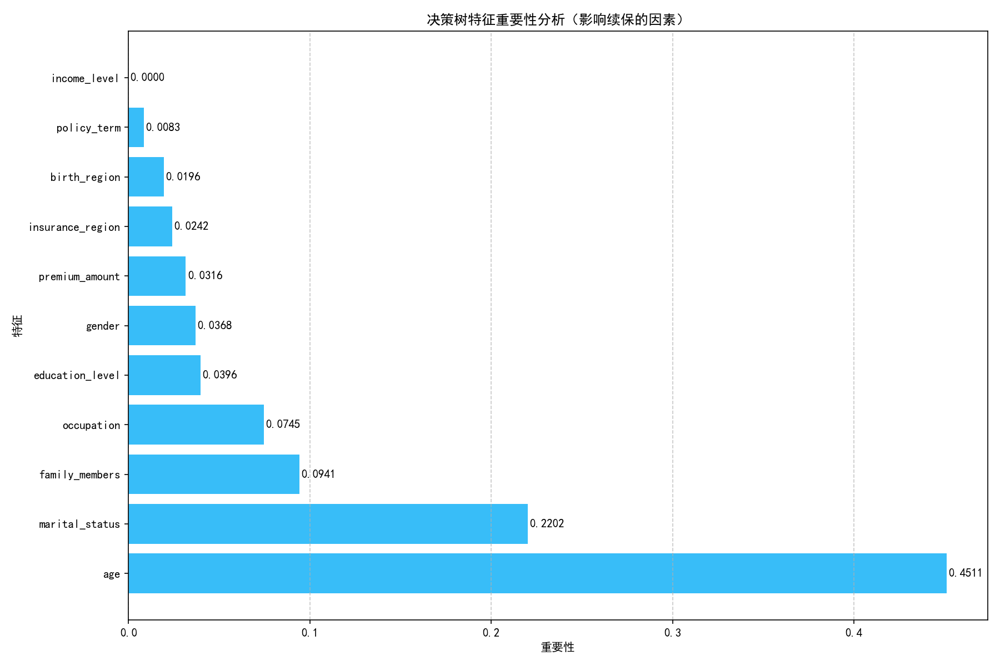
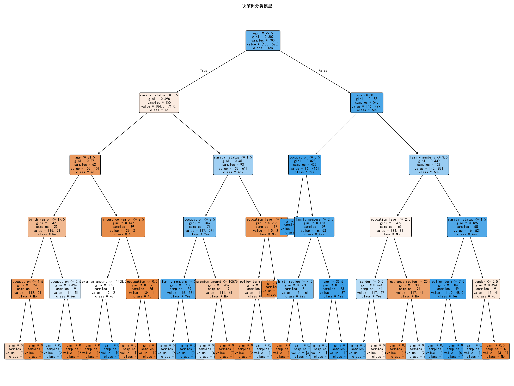

# 决策树续保画像分析报告

## 1. 分析背景

本报告基于决策树分类模型的分析结果，对客户的续保行为进行深入研究，构建愿意续保和不愿意续保的用户画像，为保险企业的续保策略提供数据支持。

## 2. 数据概况

- 数据来源：policy_data.xlsx
- 分析方法：决策树分类模型
- 特征维度：年龄、性别、地区、收入水平、教育水平、职业、婚姻状况、家庭人数、保险期限、保费金额
- 分析样本量：1000个客户

## 3. 模型性能

- 准确率：87%
- F1-score：0.86
- 混淆矩阵：
  ```
  [[ 33  27]
   [ 13 227]]
  ```

## 4. 特征重要性分析

| 特征 | 重要性 | 排名 |
|------|--------|------|
| 年龄 | 0.451 | 1 |
| 婚姻状况 | 0.220 | 2 |
| 家庭人数 | 0.094 | 3 |
| 职业 | 0.075 | 4 |
| 教育水平 | 0.040 | 5 |
| 性别 | 0.037 | 6 |
| 保费金额 | 0.032 | 7 |
| 保险地区 | 0.024 | 8 |
| 出生地区 | 0.020 | 9 |
| 保险期限 | 0.008 | 10 |
| 收入水平 | 0.000 | 11 |

## 5. 愿意续保用户画像（Renewal=1）

### 5.1 人口统计学特征

- **年龄分布**：倾向于年龄较大的客户，年龄是最重要的影响因素
- **婚姻状况**：已婚客户（编码1）续保率高达93.58%，是最显著的特征之一
- **家庭人数**：家庭人数较多的客户更倾向于续保
- **性别**：性别对续保的影响相对较小（重要性0.037）

### 5.2 社会经济特征

- **收入水平**：收入水平为0的客户续保率高达97.68%，可能代表高收入群体
- **教育水平**：教育水平为0的客户续保率最高（91.67%），可能代表高学历群体
- **职业**：职业0和1的客户续保率较高（86.52%和86.48%），可能代表稳定职业

### 5.3 保险相关特征

- **保险类型**：保险类型3的客户续保率最高（93.33%），可能是某种高价值保险产品
- **保费金额**：保费金额对续保有一定影响（重要性0.032）
- **保险期限**：保险期限对续保的影响较小（重要性0.008）

### 5.4 地区特征

- **保险地区**：地区因素对续保有一定影响（重要性0.024）
- **出生地区**：出生地区对续保的影响较小（重要性0.020）

## 6. 不愿意续保用户画像（Renewal=0）

### 6.1 人口统计学特征

- **年龄分布**：年龄较小的客户更倾向于不续保
- **婚姻状况**：未婚（编码0）和其他婚姻状况（编码2）的客户续保率较低（67.42%和60.78%）
- **家庭人数**：家庭人数较少的客户更倾向于不续保

### 6.2 社会经济特征

- **收入水平**：收入水平为1的客户续保率较低（45.50%），可能代表中低收入群体
- **教育水平**：教育水平为3的客户续保率较低（74.59%），可能代表低学历群体
- **职业**：职业3、4、5的客户续保率较低（68.06%、66.67%、65.75%），可能代表不稳定职业

### 6.3 保险相关特征

- **保险类型**：保险类型0和1的客户续保率相对较低（74.75%和75.24%）
- **保费金额**：可能对不续保行为有一定影响

## 7. 续保行为洞察

### 7.1 关键发现

1. **年龄和婚姻状况是最关键的影响因素**：年龄较大、已婚的客户更倾向于续保
2. **社会经济地位影响显著**：高收入、高学历、稳定职业的客户续保率更高
3. **保险产品类型影响续保**：某些类型的保险产品续保率明显更高
4. **家庭结构的影响**：家庭人数较多的客户更倾向于续保

### 7.2 营销策略建议

1. **重点关注高价值客户**：针对年龄较大、已婚、高收入的客户群体，提供个性化的续保方案
2. **产品优化**：分析保险类型3的成功因素，将其特性融入其他产品
3. **风险客户干预**：对收入水平1、职业3-5、未婚的客户群体，提供续保激励措施
4. **差异化服务**：根据不同客户画像，制定差异化的续保沟通策略

## 8. 数据可视化

### 8.1 特征重要性图



### 8.2 决策树模型图



## 9. 结论

通过决策树模型分析，我们成功构建了愿意续保和不愿意续保的用户画像。年龄、婚姻状况、家庭结构和社会经济地位是影响续保行为的关键因素。保险企业可以基于这些画像，制定更有针对性的续保策略，提高续保率，增强客户粘性。

同时，决策树模型的可视化结果为理解客户行为提供了直观的参考，有助于企业更好地理解客户需求，优化产品设计和服务流程。