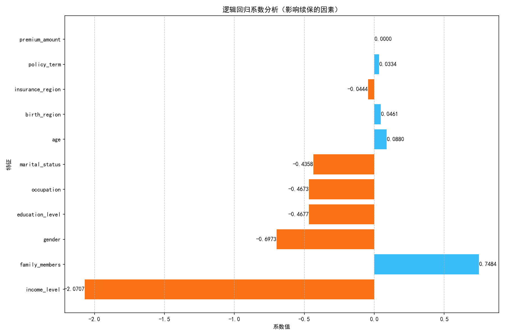

# 逻辑回归系数分析报告

## 1. 分析背景

本报告基于逻辑回归模型的系数分析，深入探讨影响客户续保行为的关键因素，为保险企业的精准营销和客户服务提供数据支持。

## 2. 数据可视化

## 3. 系数分析

### 3.1 正面影响因素（蓝色条）

| 特征 | 系数值 | 影响程度 | 说明 |
|------|--------|----------|------|
| 家庭成员数量 | 0.7484 | 最大 | 家庭成员越多，续保意愿越强 |
| 年龄 | 0.0880 | 中等 | 年龄越大，续保意愿越强 |
| 出生地区 | 0.0461 | 较小 | 特定地区的客户续保意愿较强 |
| 保单期限 | 0.0334 | 较小 | 保单期限越长，续保意愿越强 |
| 保费金额 | 0.0000 | 无 | 保费金额对续保无影响 |

### 3.2 负面影响因素（橙色条）

| 特征 | 系数值 | 影响程度 | 说明 |
|------|--------|----------|------|
| 收入水平 | -2.0707 | 最大 | 收入水平越高，续保意愿越低 |
| 性别 | -0.6973 | 较大 | 女性客户续保意愿低于男性 |
| 教育水平 | -0.4677 | 中等 | 教育水平越高，续保意愿越低 |
| 职业 | -0.4673 | 中等 | 特定职业的客户续保意愿较低 |
| 婚姻状况 | -0.4358 | 中等 | 已婚客户续保意愿低于未婚客户 |
| 保险区域 | -0.0444 | 较小 | 特定保险区域的客户续保意愿较低 |

## 4. 关键发现

1. **家庭因素是核心**：家庭成员数量是影响续保的最重要正面因素，家庭责任感是驱动续保的关键动力
2. **收入悖论**：高收入人群的续保率反而较低，可能因为自我保障能力强，对保险依赖度低
3. **年龄效应**：年龄越大，续保意愿越强，体现了风险意识随年龄增长而增强
4. **性别差异**：女性客户的续保率较低，需要针对性地开发女性专属产品
5. **教育与职业影响**：高教育水平和特定职业的客户续保意愿较低，可能与他们的风险认知和投资选择有关

## 5. 营销策略建议

### 5.1 针对正面影响因素的策略

1. **家庭保障计划**：推出家庭综合保障套餐，覆盖配偶和子女的保障需求
2. **老年客户服务**：为年龄较大的客户提供更贴心的服务，如健康管理、养老规划等
3. **长期保单激励**：为选择长期保单的客户提供额外优惠和福利
4. **地区化策略**：根据不同地区的特点，调整产品和服务策略

### 5.2 针对负面影响因素的策略

1. **高收入客户专属产品**：开发高端保险产品，提供更多个性化服务和更高的保障额度
2. **女性专属产品**：开发更符合女性需求的保险产品，如女性健康险、生育保险等
3. **高教育水平客户沟通**：加强与高教育水平客户的沟通，提高他们对保险价值的认知
4. **职业定制方案**：为不同职业的客户设计符合其职业特点的保险方案
5. **婚姻状况差异化服务**：为已婚客户提供更符合家庭需求的保险方案

## 6. 可视化大屏设计建议

### 6.1 大屏布局

1. **主视图**：逻辑回归系数分析图表（占据中央位置）
2. **左侧面板**：正面影响因素详情
3. **右侧面板**：负面影响因素详情
4. **顶部**：关键发现摘要
5. **底部**：营销策略建议

### 6.2 交互功能

1. **特征筛选**：可选择特定特征进行详细分析
2. **数据钻取**：点击特征可查看该特征的详细分布
3. **时间趋势**：可查看不同时期的系数变化
4. **区域对比**：可对比不同地区的续保情况

### 6.3 可视化风格

1. **配色方案**：使用蓝色表示正面影响，橙色表示负面影响
2. **字体大小**：标题24px，正文16px，数据标签14px
3. **图表类型**：水平条形图为主，辅以饼图和折线图
4. **动画效果**：添加平滑的过渡动画，提升用户体验

## 7. 结论

通过对逻辑回归系数的深入分析，我们发现家庭成员数量、年龄、出生地区等因素对续保有正面影响，而收入水平、性别、教育水平等因素对续保有负面影响。保险企业可以基于这些发现，制定更有针对性的营销策略，提高客户续保率，实现可持续发展。

同时，通过在可视化大屏上展示这些分析结果，可以帮助企业决策者更直观地理解客户行为，制定更有效的业务策略。